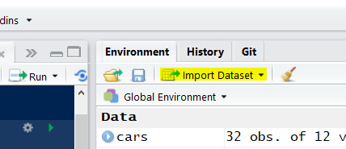

# Intro to R

## Housekeeping (Joel)

#### Overview PPT 

1. Welcome
2. What is r
3. What is [RStudio](https://www.rstudio.com/)
4. What is a Project
5. What is [Docker](https://vm-manage.oit.duke.edu/containers/rstudio)

```{r load-packages, message=FALSE, warning=FALSE}
library(tidyverse)
library(ggvis)
```

## Data Management (John)

- We'll use a derivitive of the `mtcars` dataset.  
- Use the `?mtcars` to get the codebook.

### Load Data

RStudio has an on-board data loading wizard which uses the `readr()` package for data loading.  
See Menubar `File > Import Dataset`

> 

&nbsp;

```{r get data, message=FALSE, warning=FALSE}
# readr::read_csv
# 'read_csv()' is part of the 'readr' package and will override the base-R default of converting characters as factors.  https://cran.r-project.org/web/packages/readr/README.html

cars <- read_csv("data/cars.csv")
```

### View your data in a grid

```{r}
View(cars)
# Displays as a tab in the source-pane quadrant
# Does not dipsplay in an R Notebooks
```

#### Other Data Loaders, a selective list

- `View()` is an exploratory convenience; it's not "reproducible" in the sense of generating a report or leaving a trail of your work.  One of the advantages is on-board clickable sorting

- Environment Pane has information about data objects


### Modern Data Frames: Tibbles

* "Table as data frame"", a modern tidyverse table
```{r Table-dataframe}
cars 
```

&nbsp;

### Data Structure

#### Class

```{r}
class(cars)
```

&nbsp;

#### Glimpse into a data frame

```{r}
glimpse(cars)
```

&nbsp;

#### Older style 

`str()` works on all data structures:  data frames, matricies, lists, etc.

```{r}
str(cars)
```

&nbsp;

#### Useful Command

`tbl_vars` lists table variables (column headers) as a vector

```{r variables}
tbl_vars(cars)
```

&nbsp;

## EXERCISE, Part One: Loading Data  (Joel)


- Open File:  Student_Assignments.Rmd (Part One)

OR

- Paste into Console:  `rmarkdown::run("assignment/part-one.Rmd")`

&nbsp;

## Data Reshaping - dplyr (John)

**dplyr** is a widely adopted r package, part of tidyverse, which uses **five English verbs** to reshape data

### Arrange

**Arrange** to sort rows by column
```{r arrange}
cars %>% 
  arrange(cyl, desc(mpg), desc(hp))
```

### Select
**Select** to choose columns (variables)
```{r select}
cars %>% 
    arrange(cyl, desc(mpg), desc(hp)) %>% 
    select(makeModel, cyl, mpg, hp)
```


### Filter

**Filter** to select rows
```{r filter}
sixcyls <- cars %>% 
  filter(cyl == 6)

sixcyls    # display filtered data frame
```

### Mutate

**Mutate** to create new variables (add columns) 
```{r mutate}
sixcyls %>% 
  mutate(dispWt = disp / wt) %>% 
  select(makeModel, cyl, mpg, hp, dispWt)
```

### Count
**Count** to summarize observations (or rows)
```{r count}
sixcyls %>% 
  count(hp)
```

### Summarize
Summarize to collapse values into a summary

```{r}
sixcyls %>% 
  group_by(hp) %>% 
  summarize(Count = n())
```


### Put it all together

```{r alltogether}

cars %>% 
  filter(cyl >= 4, cyl <= 6) %>% 
  select(makeModel, mpg:wt) %>%
  mutate(dispWt = disp / wt) %>% 
  arrange(desc(mpg), wt)
```

## EXERCISE, Part 2 (Joel)

2. Student_Assignments.Rmd::PART TWO
**Data Management**

1. `arrange()`
2. `filter()`
3. `mutate()`
4. `select()`
5. `count()`

## Visualization with ggvis (John)

When in the data exploratory phase, you can quickly generate very basic visualizations with minimal effort.  Your visualizations then appear in the Viewer Pane.  

### Scatter Plot
Linear model and 95% confidence interval
```{r ggvis-scatter}
cars %>% 
  ggvis(~wt, ~mpg) %>% 
  layer_points() %>% 
  layer_model_predictions(model = "lm", se=TRUE)
```
[More information on ggvis scatterplots](http://ggvis.rstudio.com/cookbook.html#scatterplots)

### Bar Graph
```{r ggvis-bargraph}
cars %>% 
  mutate(cyl = factor(cyl, labels = c("four","six","eight"))) %>% 
  ggvis(~cyl) %>% 
  layer_bars()
```
[More information on ggvis bar graphs](http://ggvis.rstudio.com/cookbook.html#bar-graphs)

### Histogram
```{r ggvis-hist, message=FALSE}
cars %>% 
  ggvis(~mpg) %>% 
  layer_histograms()
```
[More information on ggvis histograms](http://ggvis.rstudio.com/cookbook.html#histograms)

### Line graph
```{r ggvis-line, warning=FALSE}
cars %>% 
  ggvis( ~wt, ~mpg) %>% 
  group_by(cyl) %>% 
  layer_lines(stroke = ~factor(cyl)) %>% 
  layer_points(~wt, ~mpg, stroke := "black", fill = ~factor(cyl))
```
[More information on line graphs](http://ggvis.rstudio.com/cookbook.html#line-graphs)

```{r ggvis-linesmooth, warning=FALSE, message=FALSE}
cars %>% 
  ggvis(~wt, ~mpg) %>% 
  group_by(cyl) %>% 
  layer_model_predictions(model="lm", se = TRUE) %>% 
  layer_points(~wt, ~mpg, stroke := "black", fill = ~factor(cyl), size := ~hp, opacity := 0.7) 
```


#### Shareable under CC BY-NC license 

Data, presentation, and handouts are shareable under [CC BY-NC license](https://creativecommons.org/licenses/by-nc/4.0/)

