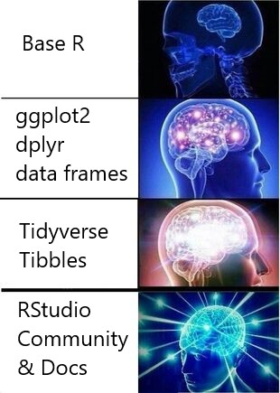
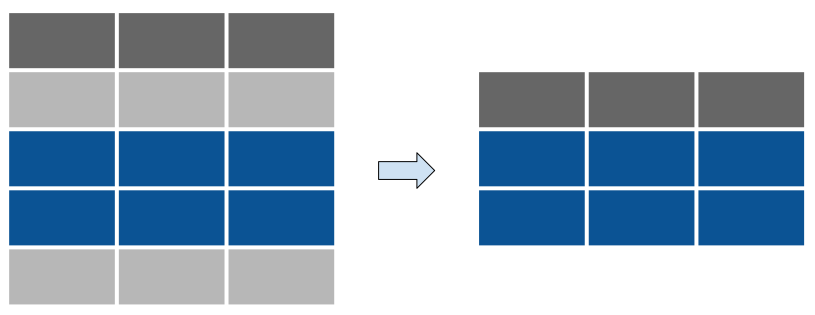
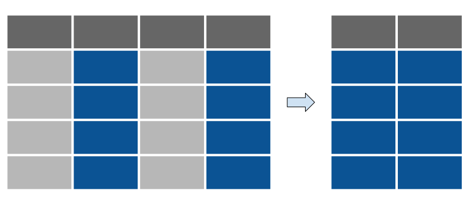

```{r setup, include=FALSE}
options(htmltools.dir.version = FALSE)
```
# Housekeeping

- Name of this Workshop
    
- Center for Data & Visualization Sciences

    - https://library.duke.edu/data

- Rfun: R We Having Fun Yet‽

    - https://rfun.library.duke.edu/
        - Video recordings, shareable code, & data 
        - [R Open Labs](https://rfun.library.duke.edu/portfolio/r_open_labs/)


- Today
    - https://JohnLittle.info/
    - Duration
    - Bathrooms
    - Workshop Approach: Explain, Demonstrate, Hands-on
    - Further Help: Walk-in, Email, By Appointment
    - Our/Your Computer Lab

---
class: middle
## URLs for Today

- Slide Deck -- https://rfun.library.duke.edu/intro2r/slides/

- Shareable Code:  GitHub Repository - https://is.gd/intro2r_2019spring

- Intro to R: Online Guide -- https://rfun.library.duke.edu/intro2r

- Cloud -- https://is.gd/gentler

---
class:  middle
## Goals for Today

.pull-left[
- Why R ; Why RStudio

- Basic RStudio navigation

- Import Data

- Transform Data]

.pull-right[
```{r echo=FALSE, fig.width=8, message=FALSE, warning=FALSE}
library(tidyverse)
library(ggpubr)
plot1 <- ggplot(data = fct_count(starwars$eye_color, sort = T) %>% head(6), aes(x = f, y = n)) +
  geom_col() +
  coord_flip() +
  xlab(NULL) +
  ylab("count")

plot2 <- ggplot(data = starwars, ) +
  geom_bar(aes(x = fct_rev(fct_lump(fct_infreq(eye_color), n = 5)))) +
  geom_bar(data = starwars %>% filter(eye_color == "orange"), aes(eye_color), fill = "orange") +
  annotate("text", label = "Rare Color", x = 2, y = 4.2) +
  coord_flip() +
  labs(title = "Eye color of Star Wars Characters",
       x = "", y = "",
       caption = "data source: dplyr::starwars") +
  theme_bw()
  

plot3 <- ggplot(data = starwars, aes(x = fct_lump(fct_infreq(eye_color), n = 5))) +
  geom_bar(aes(fill = gender)) +
  xlab(NULL)

ggarrange(ggarrange(plot1, plot2, ncol = 2), 
          plot3, nrow =2)


```
]

---
class: duke-softblue, middle

# Why R

**Data-First** Programming Language

- Statistical language developed in the early 90s 

- Derived from the S language (mid 70s)
    
**Reproducibility** enabled

- **Coding**: open and transparent
- [Literate Programming](https://en.wikipedia.org/wiki/Literate_programming)

    - Reports derived from code

- **Version Control**

Extremely helpful [RStudio Community](https://community.rstudio.com/)

---
class: middle
# R Packages

Extends R into your domain of interest.  Choose from  thousands of R packages.

- [Tidyverse](https://www.tidyverse.org/packages/)
- [Quick List of Useful Packagse](https://support.rstudio.com/hc/en-us/articles/201057987-Quick-list-of-useful-R-packages)
- [CRAN](https://cran.r-project.org/)
- [ROpenSci](https://ropensci.org/)
- [BioConductor](https://www.bioconductor.org/)

---
class: middle
# Why RStudio

- Free Integrated **Development Environment** (IDE)
- Supports Publishing through RStudio hosting

    - [RPubs](https://rpubs.com/) (free) | [Getting Started](https://rpubs.com/about/getting-started)
    - RStudio Connect (teams | $$)

    - Or host your reports other places (free)
        - Duke has many hosting options
        - **Netlify.com**
        - GitHub Pages

---
class: middle
## Tidyverse

An opinionated set of packages for data science

- Consistent set of packages

- Consistency extends across packages

- Great documentation:  https://www.tidyverse.org/packages/

- Community Support at [RStudio Community](https://community.rstudio.com/)

    
---
# Base R v Tidyverse

.pull-left[.content-box-neutral[

```{r echo=FALSE, fig.cap="Base R v Tidyverse"}

```

]]
.pull-right[

&nbsp;

&nbsp; 


&nbsp; | Base R | Tidyverse
:--- |:--- |:---
Born | 1993 | [2007 - 2017?]
Comment | Core language | Consistent [DS](https://en.wikipedia.org/wiki/Data_science) grammar and syntax
Benefit | Necessary | Quick to learn: Consistent, Modern, [Documentation](https://www.tidyverse.org/packages/), [Community](https://community.rstudio.com/)
Conference | [UserR!](https://www.r-project.org/conferences/) | [RStudio::Conf](https://www.rstudio.com/conference/)
]

---
class: duke-orange

# Let's Begin

- Part 0: **Projects** & importing data
- Part 1: **dplyr** -- data transformations
- Part 2: **ETD/join** -- exploratory data transformations & skimr
- ------
- Part 3: **Brief** introduction to [ggplot2](https://rfun.library.duke.edu/portfolio/ggplot_workshop/)
- Part 4: [GIS/Mapping](https://rfun.library.duke.edu/portfolio/mapping_workshop/)
- Part 5: Importing Large Files
    
---
class: duke-softblue
## Import data into a Project

An [RStudio project](https://r4ds.had.co.nz/workflow-projects.html#rstudio-projects) is a folder (directory) and can be a version control repository

- Keep all files together

- Paths are relative to the project

- Optional: version control. e.g. git repository

- Reproducibility


---
### Literate Coding

.pull-left[.content-box-grey[
```{r console image, echo=FALSE}
knitr::include_graphics('https://d33wubrfki0l68.cloudfront.net/9a23d664f0f49bc2ef8e78bed6277dd48bd2b96d/af132/diagrams/rstudio-console.png')
```
.tiny[.right[Image Credit: [R for Data Science](https://r4ds.had.co.nz/introduction.html#rstudio)]]

.pull-left[
**RStudio Console**

- Console
]
.pull-right[
- Import Files
- Script Editor
- Packages
- Help
]]]
.pull-right[.content-box-yellow[
```{r rmarkdown image, echo=FALSE}
knitr::include_graphics('https://bookdown.org/yihui/rmarkdown/images/notebook-preview.png')
```
.tiny[.right[Image Credit: [R Markdown: The Definitive Guide.](https://bookdown.org/yihui/rmarkdown/notebook.html#using-notebooks)]]

**R Notebook**

- YAML header
- prose
- code chunks
]]

.tiny[Implemented within the RStudio IDE: An [R Notebook](https://bookdown.org/yihui/rmarkdown/notebook.html) example of an [R Markdown](https://bookdown.org/yihui/rmarkdown/) document.]

---
class: duke-softblue
# dplyr

A grammar of data manipulation

- consistent verbs to solve common data transforms

- https://dplyr.tidyverse.org/

---
class: center
## Learn Five dplyr Verbs

Function | Usage
:--- | :---
`filter` | subset rows by variables
`arrange` | sort rows by variables
`select` | columns (variables)
`mutate` | change cell values
`count` |   
.purple[`summarize`] |


There are many [more dplyr functions](https://dplyr.tidyverse.org/reference/) 

---
class: middle, center, duke-green

# Sidebar: Common Questions

---
class: middle, center

# Assignment

Create an object using a name

## `<-`
alt-dash

"gets value from"

`answer <- 5 * 5`

---
class: middle, center

# Pipe

Chain functions together (a tidyverse or magritter conjunction)

## `%>%`  
Ctrl/Cmd-Shift-M

"and then"

`answer %>% sqrt()`

---
class: duke-softblue
# `filter`

Subset **Rows** by variables

`starwars %>% filter(eye_color == "orange")`

```{r filter, echo=FALSE}

```

---
class: duke-softblue
# `arrange` 

Sort **Rows** by variables

```
starwars %>% arrange(eye_color)

starwars %>% arrange(desc(eye_color))

starwars %>% arrange(desc(eye_color), hair_color)
```

```{r arrange, echo=FALSE}
knitr::include_graphics('images/arrange_rows.svg')
```

---
class: duke-softblue
# `select`

subset by columns (variables)

```
starwars %>% select(hair_color, eye_color)

starwars %>% select(2:4)

starwars %>% select(name:mass, 10, 7, 4:6)
```

```{r select, echo=FALSE}

```

---
class: duke-softblue
# `mutate` 

Change cell values

```
starwars %>% mutate(big_mass = mass * 100)
starwars %>% mutate(BMI = (mass / (height/100)^2))

starwars %>% mutate(
       nickname = str_c("Big", str_to_upper(hair_color), 
                        sep = " "))
```
```{r mutate, echo=FALSE}
knitr::include_graphics('images/mutate.svg')
```

---
class: duke-softblue
## `count`

Count observations by group

```r
starwars %>% count(gender)
```

## `summarize`

Reduce multiple values down to a single line

```r
starwars %>% 
  drop_na(height) %>% 
  summarise(n(), n_distinct(height), 
            min(height), max(height))

starwars %>% 
  drop_na(height) %>% 
  group_by(gender) %>% 
  summarise(Total = n(), n_distinct(height), 
            min(height), max(height)) %>% 
  ungroup()
```


---
# Learning Resources

- https://Rfun.library.duke.edu

    - [R Open Labs](https://rfun.library.duke.edu/portfolio/r_open_labs/)

- [RStudio Primers](https://rstudio.cloud/learn/primers)

- [DataQuest.io](https://dataquest.io)

- LinkedIn Learning ([via Duke](https://oit.duke.edu/what-we-do/applications/linkedin-learning))

- [R Ladies](https://rladies.org/) | [R Ladies RTP](https://www.meetup.com/rladies-rtp/)

## Installation Help

- [Primers Help](https://tutorials.shinyapps.io/00-setup/): Brief, video based instruction
- Use an **already installed version**:  in [our Lab](https://library.duke.edu/data/about/lab),[ RStudio.Cloud](https://rstudio.cloud/), [Duke Containers](https://vm-manage.oit.duke.edu/containers)


---

# John Little

&nbsp;

.pull-left[.full-width[.content-box-green[
### Data Science Librarian

- https://JohnLittle.info/

- https://github.com/libjohn
]]

### Rfun host...
You can make **Rfun** with our resources for R and data science analytics.  See the [R we having fun yet‽](https://rfun.library.duke.edu/) resource pages.
]

.pull-right[.content-box-grey[
### Duke University

**Center for Data & Visualization Sciences**

- https://library.duke.edu/data/
- askData@Duke.edu
- The /Edge, Bostock (1st Floor)
- [Past Workshops](https://library.duke.edu/data/news/past-workshops)
- [Guides & Tutorials](https://library.duke.edu/data/tutorials)

]]


---
class: center, middle
## Shareable 

Data, presentation, and handouts 

<span class="cc">
<!-- Key: a: SA, b: BY, c: CC Circle, d: ND, n: NC, m: Sampling, s: Share, r: Remix, C: CC Full Logo -->
C bn
</span>


[CC BY-NC license](https://creativecommons.org/licenses/by-nc/4.0/)

